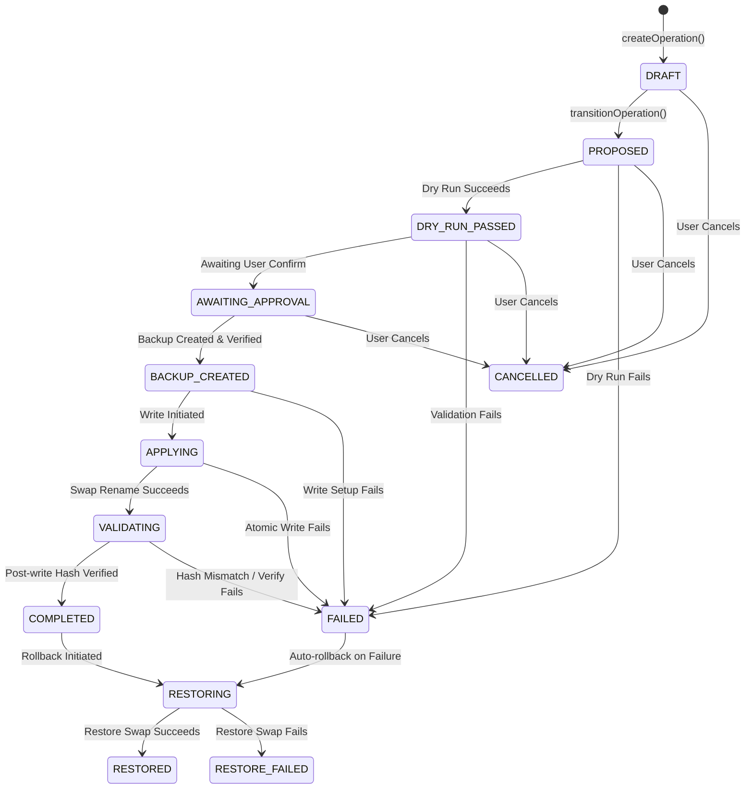

# Operation State Machine

Every file-backed modification in Solith is tracked via a strict, database-persisted operation state machine to guarantee atomicity and safety.

## Authoritative Transition Graph

## Operation States & Persistence
* **DRAFT**: Initial operational record created.
* **PROPOSED**: Operations options resolved and prepared for dry run.
* **DRY_RUN_PASSED**: The parser successfully simulated the edit on target file structure.
* **AWAITING_APPROVAL**: Prompting user for approval before backup/apply.
* **BACKUP_CREATED**: Original file backup taken, verified with double-hash check, and stored in `backups` table.
* **APPLYING**: Temporary sibling file written and validated, ready to replace target.
* **VALIDATING**: Target file replaced; verifying final target size and hash.
* **COMPLETED**: Modification successfully committed and verified.
* **FAILED**: Operation aborted during dry run or write phase.
* **RESTORING**: Rollback sequence initiated.
* **RESTORED**: Original target successfully restored from backup.
* **RESTORE_FAILED**: Target rollback failed to replace or verify.
* **CANCELLED**: Operation aborted by the user or system before backup creation.
